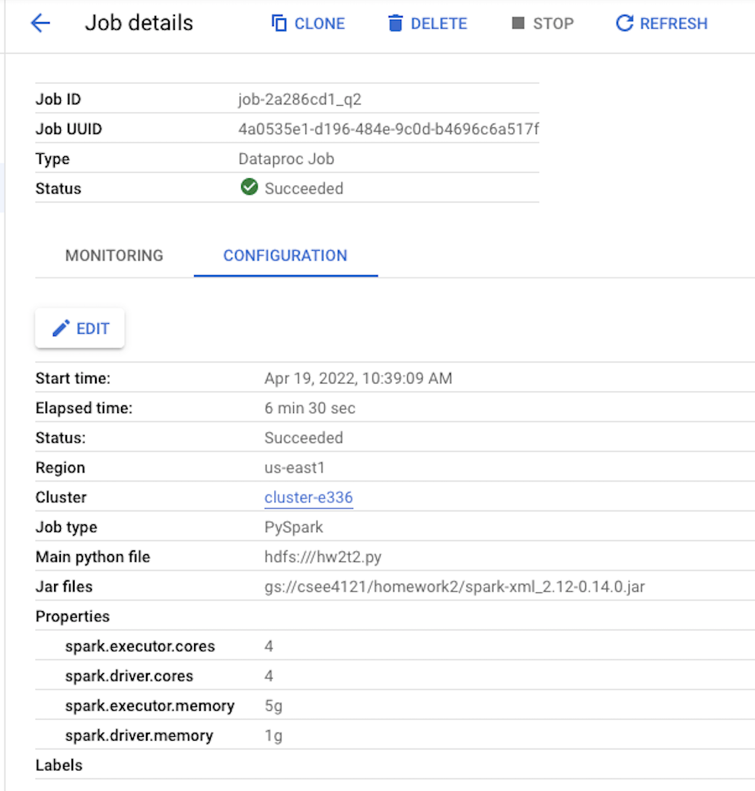
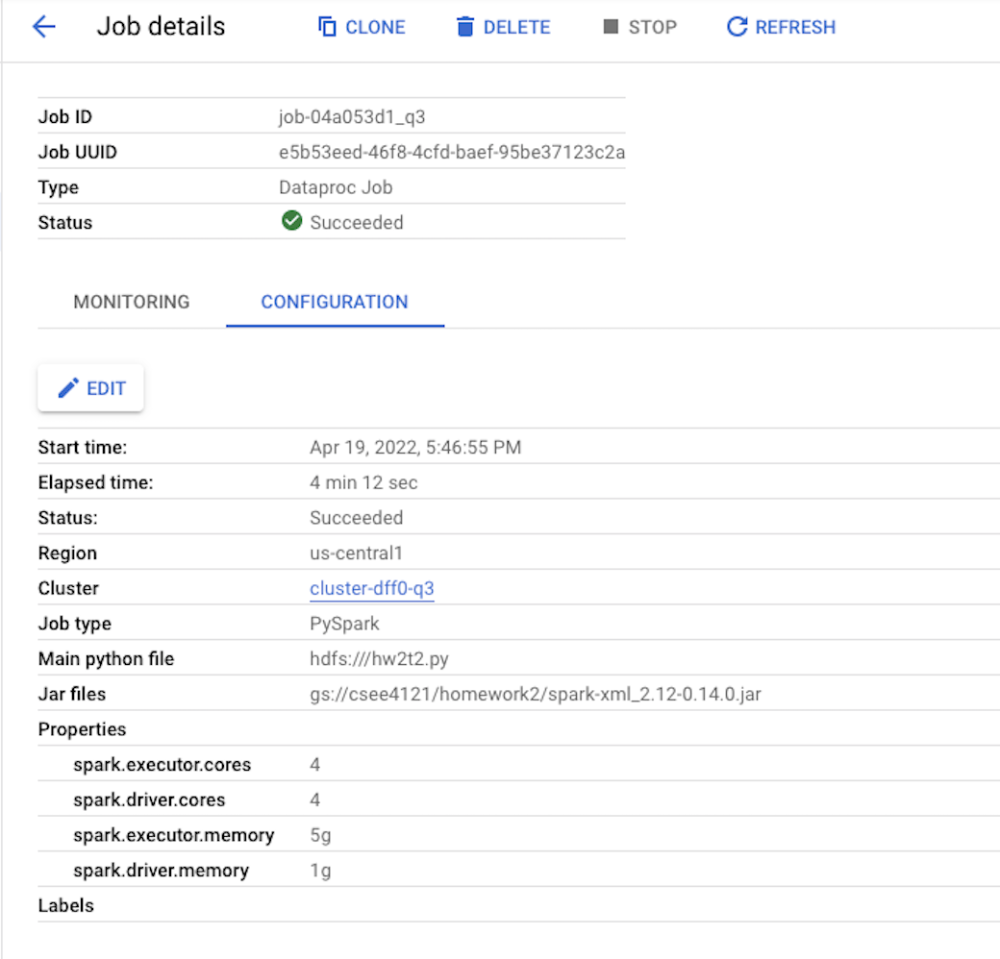
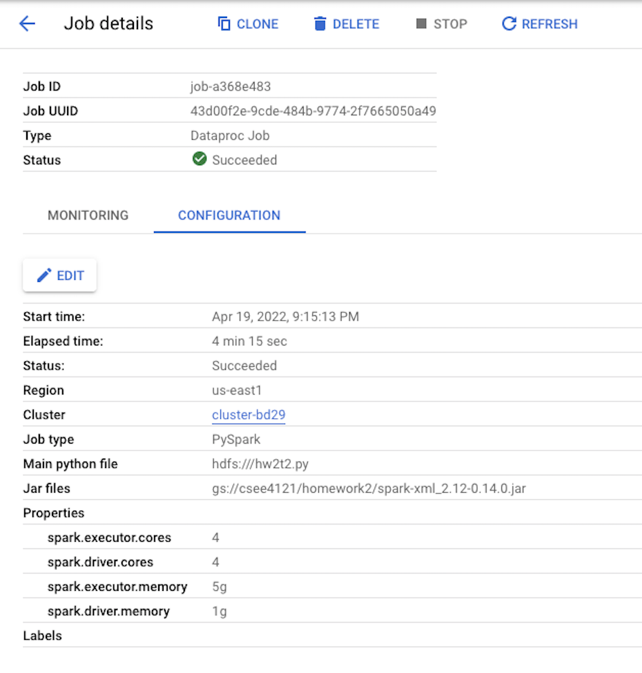
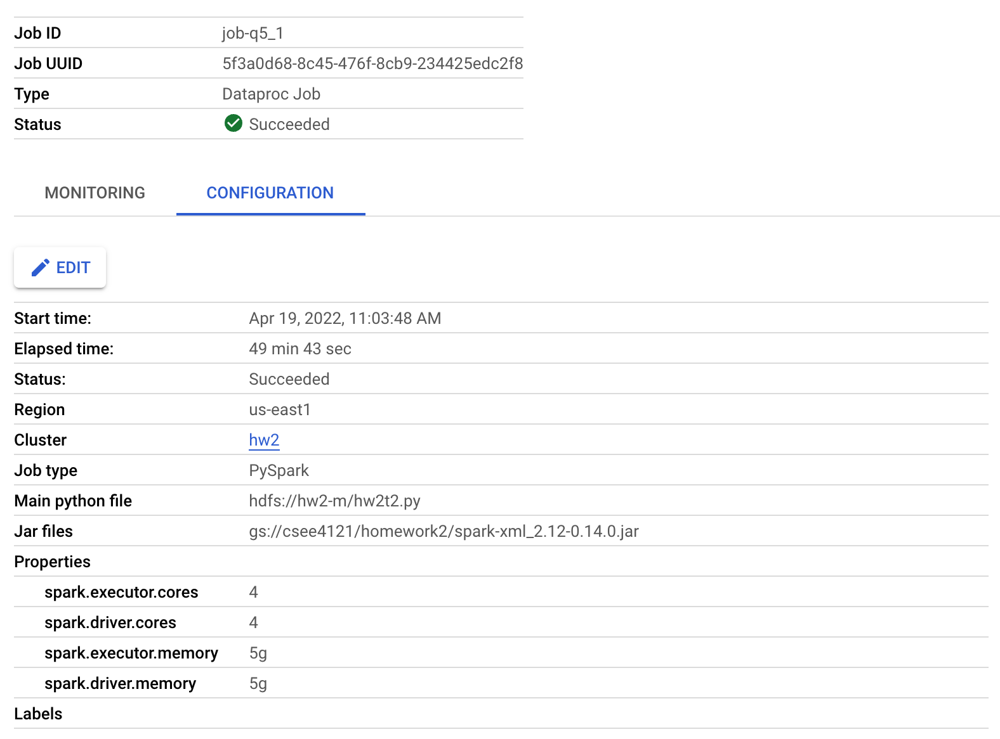
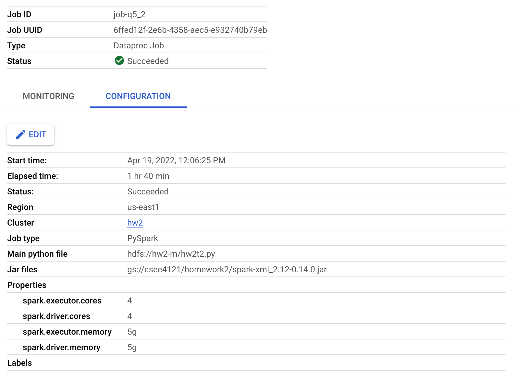
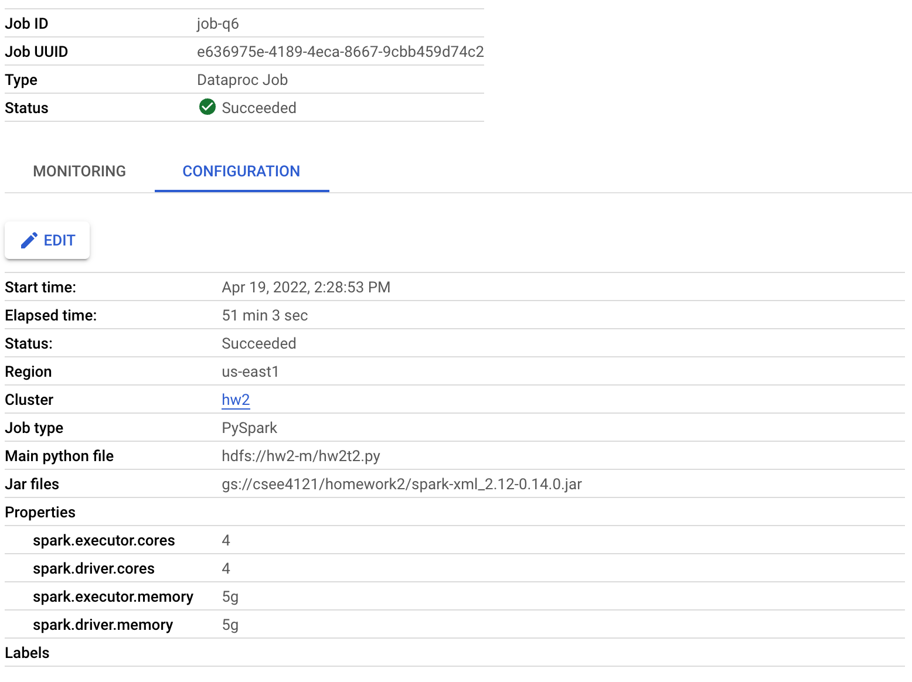
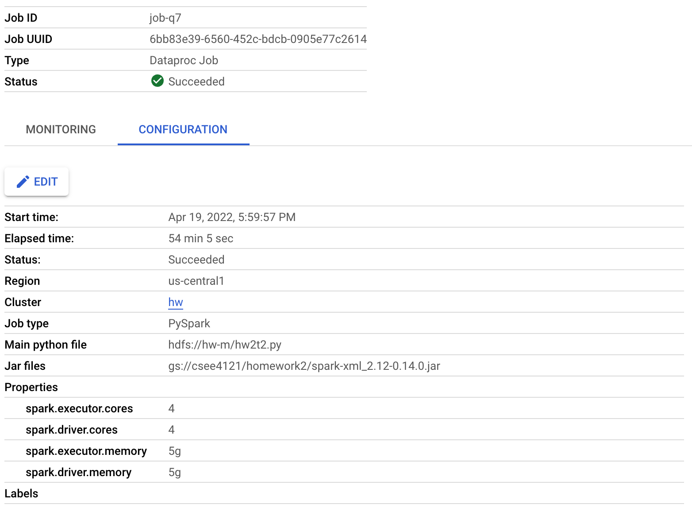
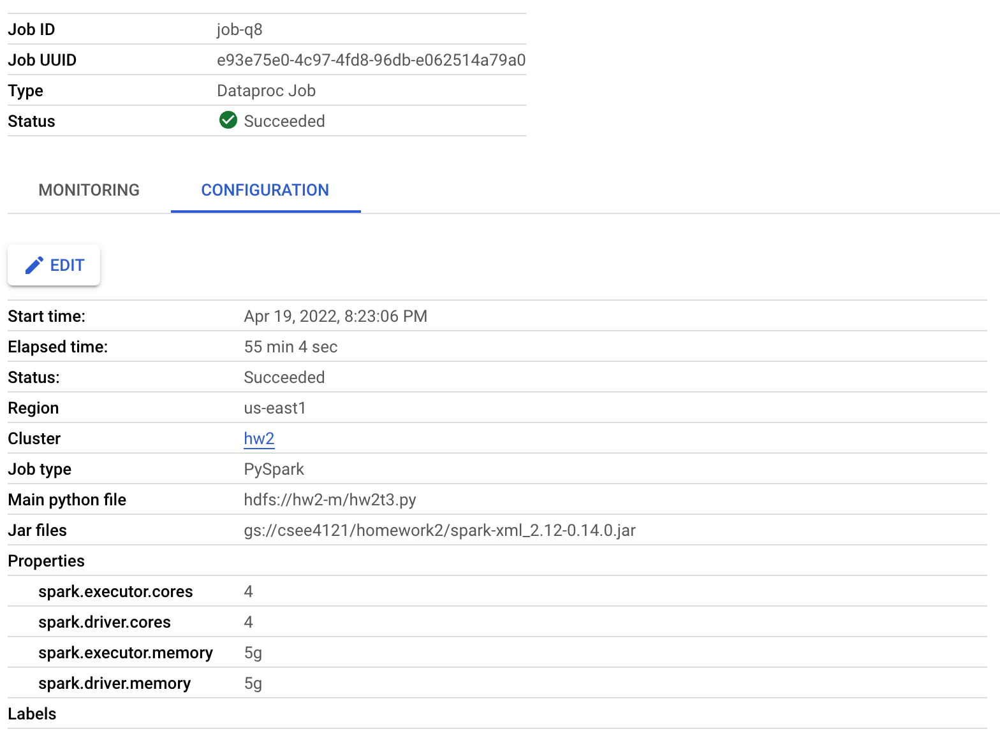

# Programming Homework 2: A Tour of Apache Spark

## Part 1: Spark and Spark SQL

### Task1

- Question 1

The default block size on HDFS is 128 MB. The default replication factor of HDFS is 2.

### Task2

- Question 2

The completion time is 6 min 30 sec.

- Question 3

The completion time is 4 min 12 sec, which is much shorter than running on a single node with 4 cores. The performance gets better becuase it uses 2 worker nodes in which they distribute the workload and run faster.

- Question 4

The completion time is 4 min 15 sec, which is very similar to the one under the default block size in HDFS, which means the block size doesn't affect the completion time a lot.

- Question 5

The original program takes 49 min 53 sec to finish. If killed one of the worker node, the job still finishes, but the completion time gets longer about 2 times of the orignial running time. Since one of the worker nodes was killed, there is now only one worker node running on the program, so the job is still processing but it runs slower.

- Question 6

The job still finished, which meaned there was no data node loss. Therefore, the completion time is similar, because the spark engine does not need to read the replicated data and the loss of data is trivial for this problem.

- Question 7

The completion time is 54 min 5 sec, which is similar to the original program. The block size doesn't affect the completion time a lot.

### Task3

- Question 8

The completion time is 55 min 4 sec.

## Part 2: Spark Streamming

### Task 1

- Question 9

There are total 1634587 articles whose rank is greater than 0.5

### Task 2

- Question 10

The data server design is feasible because data could be transferred through TCP socket. However, it is not efficient because we already get the data on the HDFS, and we could just read the data from HDFS instead of transmitting the data through network.

- Question 11

We spent about 30 hours to do this programming assignment.
