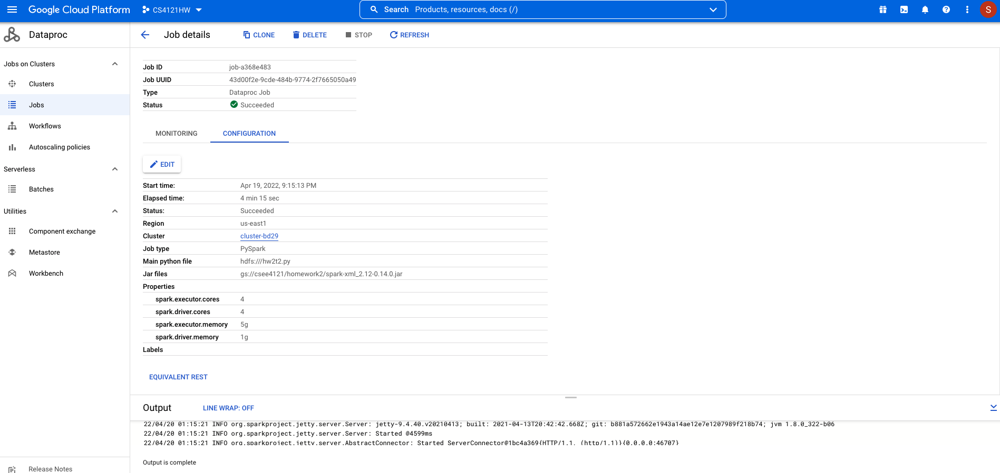
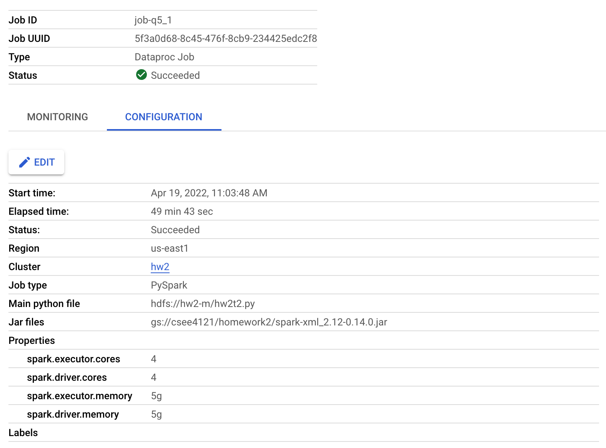
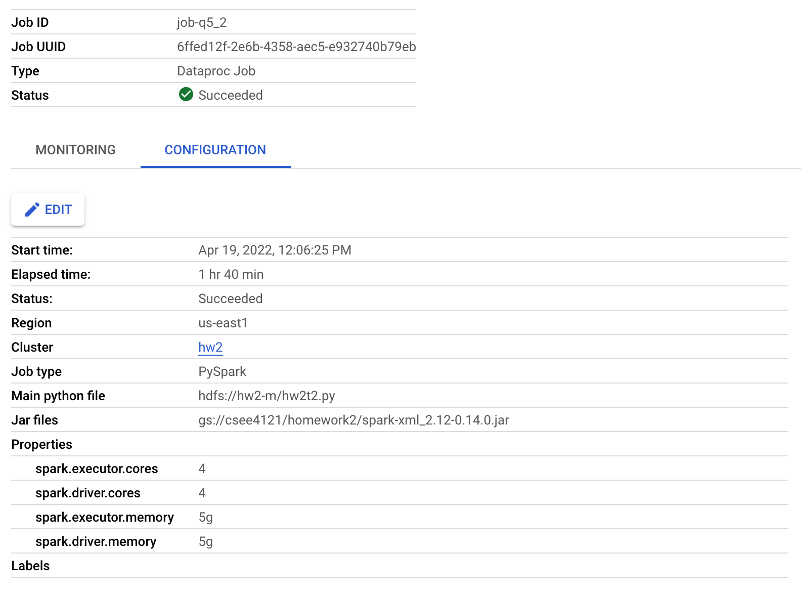
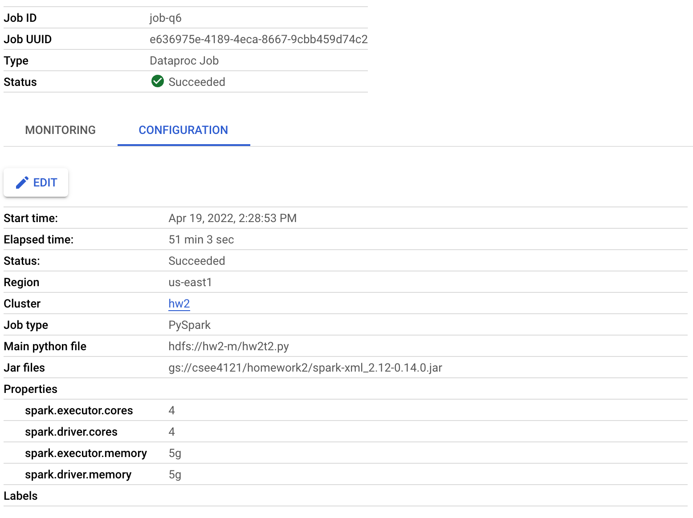
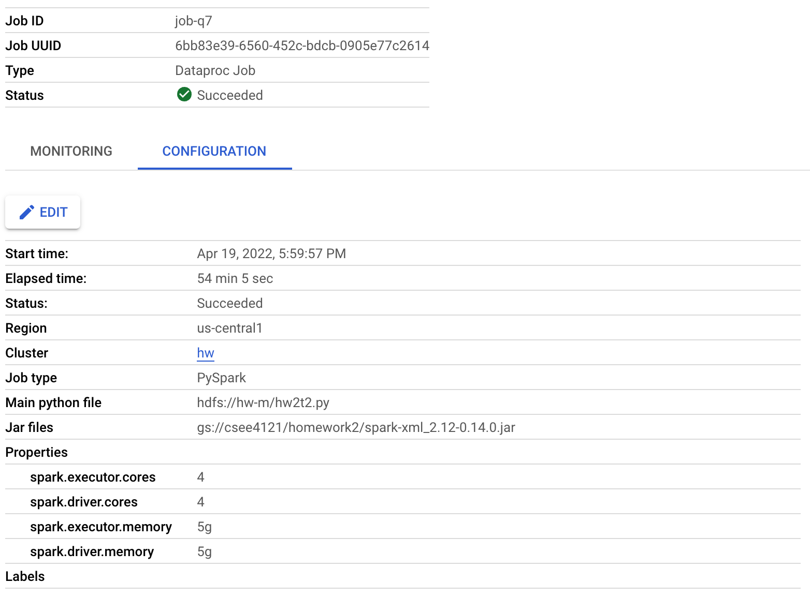
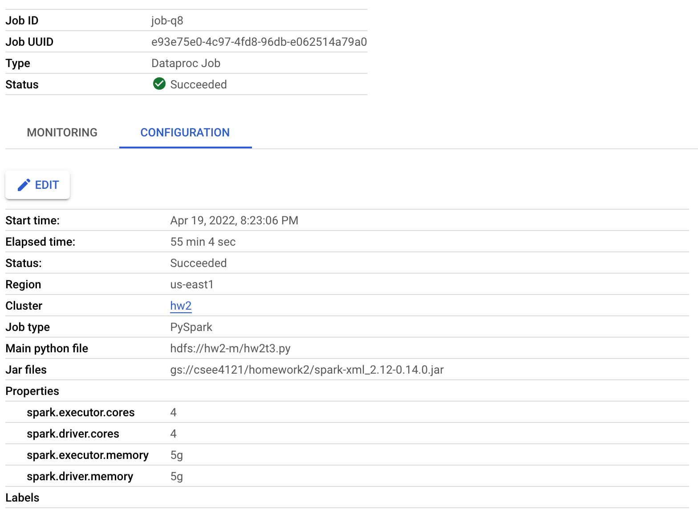

# hw2

Part 1:

- Task1

  question 1.

​		The default block size on HDFS is 128 MB. The default replication factor of HDFS is 2.

- Task2

  question 2.

  

  The completion time is 6 min 30 sec.

   

  question 3.

  

  The completion time is 4 min 12 sec, which is much shorter than running on a single node with 4 course. The performance gets better becuase it uses 2 worker nodes in which they distribute the workload and run faster.

  

  

  question 4.

  

  The completion time is 4 min 15 sec, which is very similar to the one under the default block size in HDFS. 

  

  question 5.

  

  

  

  The job still finishes, but the completion time gets longer. Since one of the worker nodes was killed, there is now only one worker node running on the program, so the job is still processing but it runs slower.

  

  question 6.

  

  The completion time is similar, because the loss of data is trivial for this program.

  

  question 7.

The completion time is similar.

- Task3

  question 8.

The completion time is 55 min 4 sec.

Part 2:

